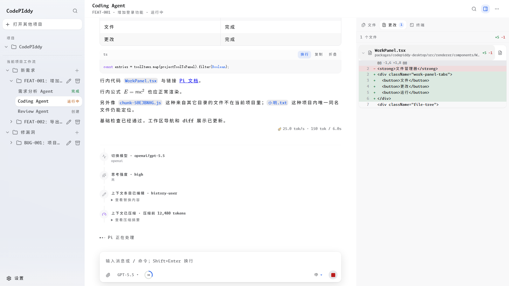
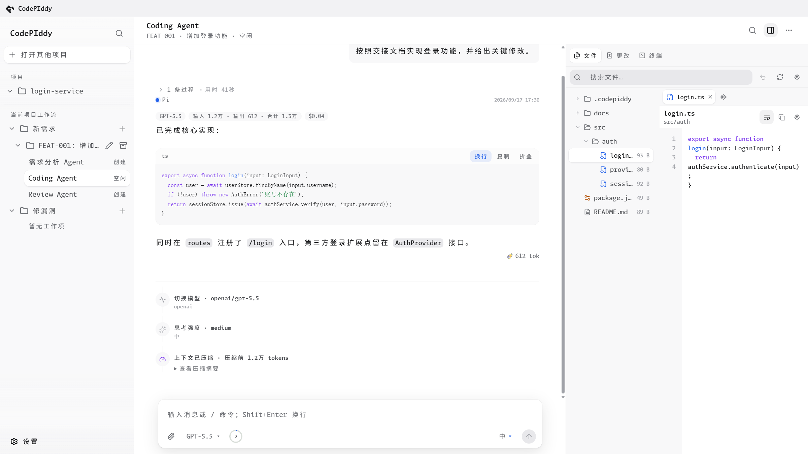
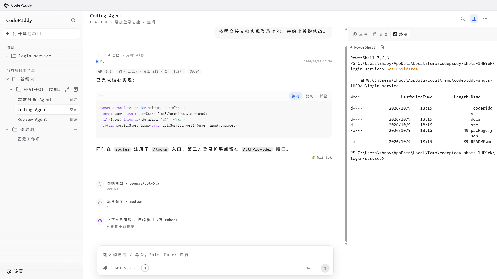
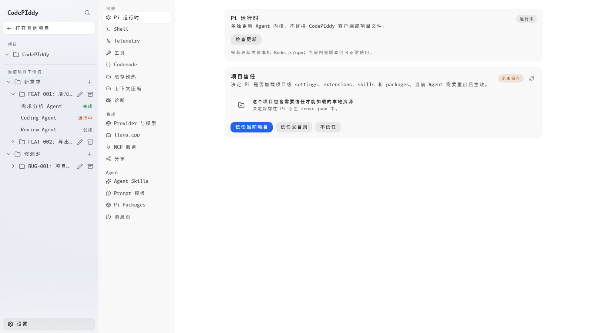

<p align="center">
  
</p>

<h1 align="center">CodePIddy</h1>

<p align="center"><strong>基于 Pi 的 Windows 桌面编码工作台：把需求和缺陷修复变成可管理、可回看、可交接的长期工作流。</strong></p>

<p align="center">
  
  
  
  
</p>

<p align="center">
  <a href="https://github.com/ZhAOYuBo1/PI-Desktop-NativeVersion01/releases/latest"><strong>下载 Windows 版本</strong></a>
</p>

<p align="center">
  
</p>

## 这是什么

CodePIddy 是 [Pi](https://github.com/earendil-works/pi) 的原生桌面客户端。它把程序员日常的两类工作放进同一个工作台：

- 做一个新需求；
- 修一个已经存在的问题。

每个工作项下可以挂固定职责的长期 Agent：需求分析、Coding、Bug Fix、Review。它们不靠隐藏的进程内记忆互相调用，交接依靠项目里的真实产物：OpenSpec 文档、Git diff、测试结果和会话记录。

Pi 仍然是底层事实源。模型、Provider、Session、Tool、Skill、Slash Command、MCP、Codemode、compaction 和 session 存储都来自 Pi。CodePIddy 负责项目与 Agent 编排、桌面 UI、工作区、终端、设置和本地展示层。

## 核心能力

### 会话页

消息页直接读取 Pi 的 `get_entries` 完整 session entries，不使用压缩后的 `get_messages` 作为历史来源。因此 compact 之后仍然能看到压缩前的会话前缀。

- 按用户轮次分组，历史过程默认折叠，最新运行轮次自动展开。
- 工具调用完成后收成一行语义摘要，失败时保留诊断和「显示全部」。
- 每条 AI 回复显示实际使用的模型、thinking level、usage 和成本；历史回复不会被当前模型覆盖。
- 支持 Markdown、GFM 表格、KaTeX、代码高亮、代码折叠、整段复制和消息内文件路径跳转。
- 原生渲染 compaction、context edit、model change、thinking level change 时间线。
- 会话内搜索支持匹配计数、前后跳转、高亮，并自动展开命中的折叠过程组。
- 助手内容按 `thinking / text / toolCall` 有序 part 展示，支持简洁 / 详细 thinking 模式和平滑流式输出。
- 左侧快速定位条只索引用户消息，最多显示 20 条，超出后用滚轮翻页。

### 工作区

右侧工作区面板提供三个视图：

| 视图 | 能力 |
| --- | --- |
| 文件 | 项目文件树、文件名搜索、全宽预览、Markdown 和代码高亮、系统打开、编辑器标签页 |
| 更改 | 汇总最新一轮 `edit / write` 产生的 diff，按文件分组，展开后原地查看行级变更 |
| 终端 | 内嵌真实 PTY，使用 `xterm.js` + `node-pty`，支持补全、方向键历史、颜色、选择和全屏程序 |

工作区文件写入受项目边界、realpath 和 Agent write lease 约束。

### 设置与 Pi 配置

设置页覆盖：

- Pi 运行时检查、更新和回退；
- Provider、模型、认证和常用模型范围；
- MCP 服务与工具 exposure；
- Shell 路径和 Pi 原生 `shellCommandPrefix`；
- 上下文压缩、分支摘要和 per-model override；
- Cache Warming、Telemetry、Codemode 和 Tool Search；
- Agent Skills、Prompt 模板和 Pi Packages；
- 消息页的 thinking 显示模式与平滑流式偏好。

客户端只读写 Pi 原生 `settings.json`、`models.json`、`mcp.json` 或自己明确的本地设置文件，不复制 Pi core 的内部实现。

## 界面

### 会话与更改

中间是会话流，右侧是工作区。截图里的会话同时展示了回复元信息、代码块、文件 chip、原生 session entry 行和按文件分组的 diff。


### 文件

文件视图可以在树和全宽预览之间切换，支持项目内文件搜索、语法高亮、Markdown 预览和多标签编辑。



### 终端

终端是真正的 PTY，不是把 shell 输出包装成文本。默认 profile 会读取本机 Windows Terminal 配置，找不到时回退到系统 PowerShell。



### 设置

设置页左侧按常规、集成和 Agent 分类，运行时、Provider、MCP、Skill、消息页等配置都在这里完成。



## 工作流

### 新需求

```text
用户想法
  -> Requirement Analysis Agent
       -> Grill With Docs：逐项澄清需求
       -> OpenSpec：proposal / specs / design / tasks
  -> Coding Agent
       -> openspec-apply-change
       -> 代码、测试、任务状态与 Git diff
  -> Review Agent
       -> open-code-review
       -> 测试、Findings 与 Verdict
  -> 用户决定继续修正或归档
```

### 修漏洞

```text
Bug 描述
  -> Bug Fix Agent
       -> OpenSpec：问题、根因、决策与任务
       -> 修复代码并补充测试
  -> Review Agent
       -> OpenSpec + Git diff + open-code-review
  -> 用户决定继续修正或归档
```

Agent 之间不做隐藏的进程内编排。Grill 和 OpenSpec 产生的真实文件就是交接文档，不要求固定的 `requirement.md`、`implementation.md`、`fix.md` 或 `review.md`。

## 内置 Skill

以下 Skill 随客户端分发，不要求用户单独下载：

| Agent | 默认启用 |
| --- | --- |
| Requirement Analysis | `grill-with-docs`、`openspec-explore`、`openspec-propose`、`openspec-update-change` |
| Coding | `openspec-apply-change`、`openspec-sync-specs` |
| Bug Fix | `openspec-explore`、`openspec-propose`、`openspec-apply-change`、`openspec-sync-specs` |
| Review | `open-code-review` |

另外内置 `openspec-archive-change`，默认不主动分配。所有 Skill 都可以在设置中按 Agent 角色启用或停用。项目自己的 Skill 放在 `<project>/.codepiddy/.pi/skills`。

> OpenSpec Skill 调用 `openspec` CLI，Open Code Review Skill 调用 `ocr` CLI。Skill 指令随应用分发，使用对应能力时仍需要相应 CLI 和模型 Provider 可用。

## 下载与运行

前往 [GitHub Releases](https://github.com/ZhAOYuBo1/PI-Desktop-NativeVersion01/releases/latest) 下载 Windows `.exe`。

```text
Windows 10 / Windows 11 · x64
```

首次运行后，需要在 Pi 原生配置中准备至少一个可用模型或 Provider，也可以在 Agent 里用 `/login` 完成受支持 Provider 的 OAuth 登录：

```text
~/.pi/agent/models.json
~/.pi/agent/settings.json
```

> 当前 Release 未做商业代码签名，Windows 可能显示未知发布者提示。请只从本仓库 Release 下载。

## 本地开发

环境：Windows 10 / 11、Node.js 22.19+、npm。

```powershell
git clone https://github.com/ZhAOYuBo1/PI-Desktop-NativeVersion01.git
cd PI-Desktop-NativeVersion01
npm ci --ignore-scripts
npm run install:electron
npm run build:codepiddy
npm start --workspace=@codepiddy/desktop
```

- `npm ci --ignore-scripts` 按锁文件安装依赖，避免自动执行第三方安装脚本。
- `npm run install:electron` 显式下载 Electron 运行文件，首次开发必须执行。
- 内置终端依赖 `node-pty`，它使用随包的 N-API prebuild，不需要本机编译原生模块。

日常改完代码后：

```powershell
npm run build:codepiddy
npm start --workspace=@codepiddy/desktop
```

### 验证

```powershell
npm run check
npm run typecheck --workspace=@codepiddy/desktop
npm run verify:transcript --workspace=@codepiddy/desktop
```

`verify:transcript` 会启动真实 Vite + Chromium，加载 `?demo=1` 的完整演示数据并断言消息页实际渲染结果。

### 重新生成 README 截图

截图由脚本自己创建项目目录、工作项、会话历史和假 RPC fixture，不依赖本机真实项目：

```powershell
npm run build:codepiddy
node --import tsx packages/codepiddy-desktop/scripts/capture-screenshots.mts
```

产物写入 `docs/images/`。脚本会临时启动 Vite 和 Electron，结束时都会关闭。

### 构建 Windows Release

```powershell
npm run prepare:codepiddy-package
npm run package:win --workspace=@codepiddy/desktop
```

产物位于 `.artifacts/release`。

## 目录结构

```text
packages/codepiddy-desktop/              Electron Main、Preload 与 React Renderer
packages/codepiddy-core/                 Work Item、Agent Registry、Pi RPC 与写锁
packages/codepiddy-shared/               共享 IPC 与工作流类型
packages/codepiddy-agent-skills/         随应用分发的固定 Skill
packages/coding-agent/                   Pi Coding Agent Runtime
docs/images/                             README 截图
```

## 更新 Pi 内核

在 **设置 → Pi 运行时** 检查新版本，确认后从 npm 安装 `@earendil-works/pi-coding-agent`。CodePIddy 会先在独立目录校验 RPC、模型列表、命令和内置扩展，再切换到新版；现有 Agent 不会在运行中被强制中断，重启客户端后生效。安装或校验失败时保留原版本，新版启动失败会自动回退，也可以手动逐次回退。

这只更新 Pi 内核，不更新 CodePIddy UI 或项目文件。Windows 安装包自带更新所需的 npm；源码开发模式使用本机 npm。

## 安全

- Renderer 开启 Sandbox 与 Context Isolation，禁用 Node Integration。
- IPC 输入做运行时校验。
- Provider / MCP OAuth 凭据使用 Electron `safeStorage`。
- 文件面板只能列出和读取项目根目录内的路径，越界请求被拒绝。
- 工具启用范围和 MCP exposure 分别由 Pi 原生 `settings.json` 与 `mcp.json` 控制。
- 多 Agent 之间不做进程内编排，交接靠共享工作树和工作项文档。
- 当前 Windows MVP 未提供强执行沙箱，Agent 进程使用当前操作系统用户权限。

## 上游 Pi 与 License

CodePIddy 基于开源 Pi Agent Harness 开发。Pi 继续负责模型、Provider、Session、Tool、Skill 与 Slash Command，CodePIddy 提供桌面客户端、项目管理和工作流层。

本仓库保留上游 MIT License，详见 [LICENSE](LICENSE)。Bundled Skills 保留各自文件中声明的许可证和作者信息。
